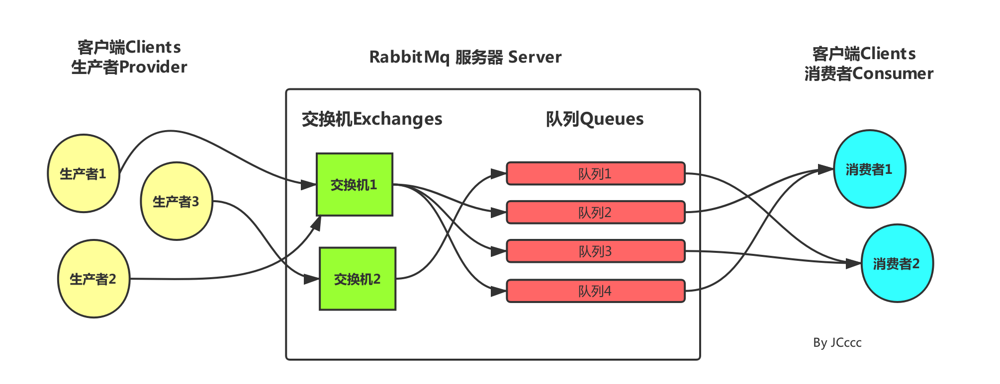

# springboot-rabbitmq

## 1.消息队列（MQ）

### 1.1 什么是消息队列

消息队列，即MQ，Message Queue。

消息队列是典型的：生产者、消费者模型。生产者不断向消息队列中生产消息，消费者不断的从队列中获取消息。因为消息的生产和消费都是异步的，
而且只关心消息的发送和接收，没有业务逻辑的侵入，这样就实现了生产者和消费者的解耦。

### 1.2 AMQP和JMS

MQ是消息通信的模型，并不是具体实现。现在实现MQ的有两种主流方式：AMQP、JMS。

两者间的区别和联系：

- JMS是定义了统一的接口，来对消息操作进行统一；AMQP是通过规定协议来统一数据交互的格式
- JMS限定了必须使用Java语言；AMQP只是协议，不规定实现方式，因此是跨语言的。
- JMS规定了两种消息模型；而AMQP的消息模型更加丰富

### 1.3 常见MQ产品

- ActiveMQ：基于JMS
- RabbitMQ：基于AMQP协议，erlang语言开发，稳定性好
- RocketMQ：基于JMS，阿里巴巴产品，目前交由Apache基金会
- Kafka：分布式消息系统，高吞吐量

## 2. 消息类型
RabbitMQ提供了6种消息模型，但是第6种其实是RPC，并不是MQ。

但是其实3、4、5这三种都属于订阅模型，只不过进行路由的方式不同。

## 3. rabbit主界面

在这个界面里面我们可以做些什么？
可以手动创建虚拟host，创建用户，分配权限，创建交换机，创建队列等等，还有查看队列消息，消费效率，推送效率等等。
一个简单的一个消息推送到接收的流程，提供一个简单的图：

黄色的圆圈是消息推送服务，将消息推送到 中间方框里面也就是 rabbitMq的服务器，然后经过服务器里面的交换机、队列等各种关系将数据处理入列后，最终右边的蓝色圈消费者获取对应监听的消息。

常用的交换机有以下三种，因为消费者是从队列获取信息的，队列是绑定交换机的（一般），所以对应的消息推送/接收模式也会有以下几种：

Direct Exchange 

直连型交换机，根据消息携带的路由键将消息投递给对应队列。

大致流程，有一个队列绑定到一个直连交换机上，同时赋予一个路由键 routing key 。
然后当一个消息携带着路由值为X，这个消息通过生产者发送给交换机时，交换机就会根据这个路由值X去寻找绑定值也是X的队列。

Fanout Exchange

扇型交换机，这个交换机没有路由键概念，就算你绑了路由键也是无视的。 这个交换机在接收到消息后，会直接转发到绑定到它上面的所有队列。

Topic Exchange

主题交换机，这个交换机其实跟直连交换机流程差不多，但是它的特点就是在它的路由键和绑定键之间是有规则的。
简单地介绍下规则：

*  (星号) 用来表示一个单词 (必须出现的)
#  (井号) 用来表示任意数量（零个或多个）单词
通配的绑定键是跟队列进行绑定的，举个小例子
队列Q1 绑定键为 *.TT.*          队列Q2绑定键为  TT.#
如果一条消息携带的路由键为 A.TT.B，那么队列Q1将会收到；
如果一条消息携带的路由键为TT.AA.BB，那么队列Q2将会收到；

主题交换机是非常强大的，为啥这么膨胀？
当一个队列的绑定键为 "#"（井号） 的时候，这个队列将会无视消息的路由键，接收所有的消息。
当 * (星号) 和 # (井号) 这两个特殊字符都未在绑定键中出现的时候，此时主题交换机就拥有的直连交换机的行为。
所以主题交换机也就实现了扇形交换机的功能和直连交换机的功能。

